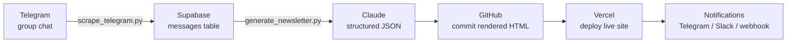

# The Automated Newsletter Pipeline — Setup Guide

This guide walks you through standing up a fully automated weekly community newsletter for a client. By the end, your client will have a newsletter that writes itself every Sunday morning — pulling content from their community chat, summarizing it with AI, and publishing a branded page on their website. Hands-free.

**Who this is for:** any operator at any level — technical or not. You don't need to be an engineer. You do need to be willing to follow steps carefully and copy/paste a few things.

**How long it takes:** about 3 hours for your first one. Subsequent clients go faster (60–90 minutes) once you've done it once.

---

## What You're Building

Think of it like hiring a tireless intern who does the same job every week:

1. **Reads** the client's community chat (Telegram by default — other platforms also work).
2. **Summarizes** the week's most interesting moments into a newsletter — story, key points, quotes from members, wins, tips.
3. **Publishes** the newsletter as a branded webpage at the client's domain.
4. **Pings** the client when it's live (optional Slack, Telegram, or webhook notification).

It does this every Sunday morning, forever, without anyone touching a thing.



*The script `run_weekly.py` orchestrates the whole flow on a Railway cron job (a fancy term for "scheduled task that runs in the cloud").*

The default flow assumes **Telegram** as the source platform. If the client uses Skool, Discord, Slack, GHL, or Facebook, see the companion *Community Connectors* guide — everything else in this guide still applies, you just swap which tool feeds the messages.

---

## Before You Start — Tools You'll Sign Up For

You'll touch six services. Most have free tiers. Here's the cheat sheet:

| Service     | What it does for you                       | Who pays?   | Free?              |
|-------------|--------------------------------------------|-------------|--------------------|
| Python      | Runs the scripts on your laptop once       | n/a         | Yes (free download) |
| Telegram    | Source of the messages being summarized    | n/a         | Yes                |
| Supabase    | The "filing cabinet" for messages + issues | Either      | Yes                |
| Anthropic   | The AI brain that writes the newsletter    | **Client**  | No — ~$0.10/issue  |
| GitHub      | Stores the newsletter code + HTML files    | Either      | Yes                |
| Vercel      | Hosts the live newsletter site             | Either      | Yes                |
| Railway     | Runs the weekly "go check the chat" cron   | Either      | ~$5/mo after trial |

**If a term is new to you:** Supabase is a database (a place to store data). GitHub stores code. Vercel hosts websites. Railway runs scheduled scripts. Anthropic is the company that makes Claude. You don't have to fully understand these — you just need accounts.

---

## Step 1 — Get the Pipeline Code

**What you're doing:** copying the scripts and templates this guide assumes you have, into the client's repository.

Copy the `newsletter-cron/` directory and the matching HTML templates into the client's repository. You'll customize a few files in there. The rest stays as-is.

```bash
cd <your-repo>/newsletter-cron
```

**Success indicator:** running `ls` (or `dir` on Windows) in that directory shows files like `scrape_telegram.py`, `generate_newsletter.py`, `run_weekly.py`, `requirements.txt`, and this guide.

---

## Step 2 — Create the Database Tables

**What you're doing:** giving the system three "filing cabinets" so it has somewhere to store messages, finished newsletters, and a counter for which issue is next.

Create a new Supabase project (or use one you already have) at [supabase.com](https://supabase.com). Once it's set up, open the SQL editor and run the three blocks below, one at a time.

### Table 1: `newsletter_config` — a single-row counter

This is just a tiny table that keeps track of which issue number is next. Like the page-number tracker at the front of a notebook.

```sql
CREATE TABLE newsletter_config (
  id            INT PRIMARY KEY DEFAULT 1,
  current_issue INT NOT NULL DEFAULT 1,
  last_run      DATE
);

INSERT INTO newsletter_config (id, current_issue) VALUES (1, 1);
```

### Table 2: `newsletter_issues` — one row per published issue

This stores every newsletter the system has ever generated — both the raw structured content (JSON) and the metadata (when it was published, what week it covered).

```sql
CREATE TABLE newsletter_issues (
  id            SERIAL PRIMARY KEY,
  issue_number  INT UNIQUE NOT NULL,
  slug          TEXT NOT NULL,
  week_start    DATE,
  week_end      DATE,
  status        TEXT DEFAULT 'draft',
  content_json  JSONB,
  generated_at  TIMESTAMPTZ,
  published_at  TIMESTAMPTZ,
  created_at    TIMESTAMPTZ DEFAULT NOW()
);
```

### Table 3: `telegram_messages` — the raw chat content

Every message scraped from Telegram gets stored here. The AI reads this table to write the newsletter.

```sql
CREATE TABLE telegram_messages (
  id             SERIAL PRIMARY KEY,
  message_id     BIGINT UNIQUE NOT NULL,
  timestamp      TIMESTAMPTZ NOT NULL,
  sender_name    TEXT,
  message_text   TEXT NOT NULL,
  reaction_count INT DEFAULT 0,
  reply_to_text  TEXT,
  week_start     DATE,
  created_at     TIMESTAMPTZ DEFAULT NOW()
);

CREATE INDEX telegram_messages_timestamp_idx ON telegram_messages(timestamp);
```

> **Why does `message_id` have to be unique?** Because the scraper might run multiple times. The unique constraint means re-running the scraper won't create duplicate rows of the same message. It just overwrites the existing one. Safe to retry.

**Success indicator:** Supabase shows three new tables in the Table Editor with the columns above. No red error messages in the SQL editor.

Different source platform? Use the `community_messages` schema from the *Community Connectors* guide instead.

---

## Step 3 — Get Telegram API Credentials

**What you're doing:** giving the scraper permission to log in as a real Telegram user (not a bot) so it can read the group chat's full history.

**Why a user account and not a bot?** Telegram bots can only read messages sent *after* they're added. They can't go back and read older messages. A real user account that's already in the group can read everything. We need that because the newsletter summarizes the *past* week.

### How to do it

1. Go to [my.telegram.org/apps](https://my.telegram.org/apps) and sign in with the phone number for the account that's already in the client's group (often the client themselves).
2. Click **"Create new application"**.
3. Fill in any app title and short name — Telegram doesn't care what they say.
4. Copy two values to a notepad:
   - **App api_id** — a short number (e.g., `36663400`)
   - **App api_hash** — a long string of letters and numbers

You'll also need to know which group the scraper should read. To get the group's ID:

1. Open Telegram on a desktop (web.telegram.org works fine).
2. Click into the group.
3. Look at the URL: it'll have something like `#-1001234567890` at the end. That number (including the minus sign) is the group's chat ID.
4. Alternatively, if the group has a public username like `@aijunkies`, that works too.

**Keep these three values handy** — you'll paste them into the config file in Step 7.

---

## Step 4 — Make a GitHub Token

**What you're doing:** giving the script permission to publish the rendered HTML newsletter to the client's GitHub repository every Sunday.

GitHub doesn't let scripts log in with your password (good — that would be insecure). Instead, you create a "token" — a one-time password the script uses on your behalf.

### How to do it

1. On GitHub, click your avatar → **Settings** → scroll down to **Developer settings** (left sidebar) → **Personal access tokens** → **Fine-grained tokens**.
2. Click **Generate new token**.
3. **Token name:** something memorable like `newsletter-cron-<clientname>`.
4. **Expiration:** 1 year. (Pro tip: set a calendar reminder 11 months out to make a new one before this expires.)
5. **Repository access:** select **"Only select repositories"** and choose just the client's newsletter repo. Don't grant it access to all your repos.
6. **Permissions:** scroll to **Repository permissions** → set **Contents** to **Read and Write**. Leave everything else alone.
7. Click **Generate token** at the bottom.
8. Copy the token — it starts with `github_pat_...` — and save it to a notepad. You can never see it again after closing this page.

---

## Step 5 — Connect Vercel for Deployment

**What you're doing:** telling Vercel to rebuild the client's website every time the script publishes a new newsletter to GitHub.

The script doesn't deploy the website itself. It just commits the new HTML file to GitHub, then tells Vercel "hey, there's new code." Vercel handles the actual deployment.

### How to do it

1. On [vercel.com](https://vercel.com), make sure the client's GitHub repo is already connected as a Vercel project. If it's not, click **Add New** → **Project** → import the GitHub repo. (This is standard Vercel setup; ask Vercel docs if you're new.)
2. Once the project exists in Vercel, open it.
3. Go to **Settings** → **Git** → scroll to **Deploy Hooks**.
4. Click **Create Hook**.
   - **Name:** `newsletter-cron`
   - **Git Branch:** `main`
5. Click **Create**, then copy the URL it gives you. Save it to your notepad.

That URL is what the script "pokes" every week to trigger a deploy.

---

## Step 6 — Customize the HTML Template

**What you're doing:** making the newsletter look like the client's brand instead of the default look.

The system uses a **template file** — basically a webpage with blank spots in it. Every Sunday, the script fills in the blank spots with new content. The template controls how the page LOOKS; the script fills in WHAT it says.

The template file lives at:

```
public/newsletter/junk-mail-TEMPLATE.html
```

The blank spots look like `[HEADLINE]`, `[DATE RANGE]`, `[Para 1 — explanation]`, etc. The script finds these brackets and replaces them with real content.

### What to customize

1. **Open the template file** in any text editor.
2. **Edit the CSS** (the part inside `<style>` tags) to match the client's brand:
   - Their brand colors (replace the existing hex codes)
   - Their fonts (if they use Google Fonts, swap the link at the top)
   - Their logo (replace the existing `` or text logo)
   - Their footer text and any disclaimers
3. **Leave the bracketed placeholders alone.** Things like `[HEADLINE — punchy, specific, not generic]` are the "blank spots" the script fills in. If you rename or delete a placeholder, the script won't know what to do with it.

Also check `public/newsletter/index.html` — that's the "all issues" listing page. The script auto-adds a new row to it each week. Style this page too if the client wants it on their site.

> **What if the client changes their mind on branding?** No problem — just edit the template file, and the next issue (and all future issues) will use the new look. Existing published issues stay as they are unless you regenerate them.

---

## Step 7 — Local Setup (one time only)

**What you're doing:** running the scripts on your own laptop once, to (a) prove everything works before deploying to the cloud, and (b) do the one-time Telegram login that can't be done unattended in the cloud.

This is the most fiddly step. Take your time.

### 7a. Install Python and dependencies

If you don't already have Python installed:
- **Mac/Linux:** Python usually comes pre-installed. Type `python3 --version` in a terminal. If you see `3.10` or higher, you're good.
- **Windows:** Download Python 3.12+ from [python.org/downloads](https://python.org/downloads). During install, check the box that says "Add Python to PATH".

Then, from inside the `newsletter-cron/` directory:

```bash
pip install -r requirements.txt
```

You'll see a bunch of "Successfully installed..." lines. That's good.

### 7b. Make your `.env` file

`.env` is where you put all your secrets and config values. It's a plain text file — open any text editor.

In the `newsletter-cron/` directory, there's a file called `.env.example`. Copy it and rename the copy to `.env` (no extension after the dot). Then fill in each line:

```
SUPABASE_URL=https://<your-project>.supabase.co
SUPABASE_SERVICE_KEY=<the long JWT — see below>
ANTHROPIC_API_KEY=sk-ant-...
TELEGRAM_API_ID=<from Step 3>
TELEGRAM_API_HASH=<from Step 3>
TELEGRAM_GROUP=<from Step 3 — @username or chat id>
TELEGRAM_SESSION_STRING=        # leave blank for now — Step 7c fills this in
GITHUB_TOKEN=<from Step 4>
GITHUB_REPO=<owner>/<repo>
VERCEL_DEPLOY_HOOK_URL=<from Step 5>
NEWSLETTER_BASE_URL=https://<site>/newsletter
```

**Where to find each value:**

- `SUPABASE_URL` — Supabase project → Settings → API → "Project URL".
- `SUPABASE_SERVICE_KEY` — Supabase project → Settings → API → reveal the **`service_role`** key (NOT the `anon` key). This is a very long string of letters, numbers, and dots — make sure it all lands on one line in `.env`.
- `ANTHROPIC_API_KEY` — [console.anthropic.com](https://console.anthropic.com) → API Keys → create a new key. The client should be the one paying for this; either use their account or have them issue you a key.

> **Common mistake:** when you paste a long value like the Supabase service key, some editors will hard-wrap it onto two lines. The script will silently fail to read it. **Make sure each value is on the same line as its `=` sign.** No line breaks inside a value.

### 7c. Run the Telegram login once

Now you do the one-time "log into Telegram as a user account" dance. From the `newsletter-cron/` directory:

```bash
python scrape_telegram.py auth
```

It'll prompt you for three things in sequence:

1. **Phone number** — the phone number for the Telegram account that's in the group. Include the country code (e.g., `+12025551234`).
2. **SMS code** — Telegram immediately texts a 5-digit code. Type it in.
3. **2FA password** — only if 2-factor auth is on for the account.

When it's done, it prints a long blob of text labeled `TELEGRAM_SESSION_STRING`. It looks something like `1ApWapzMBu5l...` and goes on for about 350 characters.

**Copy that whole blob** (carefully — don't drop the trailing equals signs if there are any) and paste it into `.env` after `TELEGRAM_SESSION_STRING=`. Save the file.

> **What is this session string?** It's a saved "login token" — like staying logged in to a website. The script uses it to act as the user account without needing the phone+SMS dance every time. Treat it like a password.

### 7d. Backfill the last week of messages

Pull a week's worth of messages into Supabase, so the generator has something to write about:

```bash
python scrape_telegram.py backfill --start YYYY-MM-DD --end YYYY-MM-DD
```

Use last Sunday to last Saturday. E.g., if today is Wednesday June 3, last week was May 25 (Sun) through May 31 (Sat):

```bash
python scrape_telegram.py backfill --start 2026-05-25 --end 2026-05-31
```

You'll see logs like:

```
Resolved entity: <group name>
Collected 437 messages from Telegram
Upserted 437 / 437
```

**Success indicator:** "Upserted X / X" with X being a number bigger than 20. If it's lower, the group's been quiet — try a different week or ask the client.

### 7e. Generate the first issue (dry run)

Now have Claude write the newsletter, but don't publish it yet. Use `--dry-run` to see the JSON output first:

```bash
python generate_newsletter.py --week-start 2026-05-25 --issue-number 1 --dry-run
```

It'll call Claude, print the structured newsletter content, and stop. Read through it. Does the voice sound right? Are the headlines specific? Do the member quotes feel authentic? If yes, you're ready to ship for real. If not, tweak the Claude system prompt (Step 8) and re-run the dry run.

### 7f. Publish issue #1

When the dry-run output looks good, publish for real (drop the `--dry-run` flag):

```bash
python generate_newsletter.py --week-start 2026-05-25 --issue-number 1
```

This time it:
- Saves the content to Supabase
- Bumps the issue counter
- Commits the rendered HTML to GitHub
- Triggers a Vercel deploy
- Marks it published

**Success indicator:** the script ends with `Issue #1 complete — https://<site>/newsletter/issue-001`. Open the URL in a browser. You should see a fully styled newsletter with real content — no leftover `[BRACKET]` placeholders.

---

## Step 8 — Customize Claude's Writing Style

**What you're doing:** teaching Claude how the client wants the newsletter to sound.

There's a big block of text inside `generate_newsletter.py` called `SYSTEM_PROMPT`. This is the instructions Claude reads before writing each newsletter. Think of it like onboarding documentation for a brand-new copywriter.

### What to change in the prompt

Open `generate_newsletter.py` and find `SYSTEM_PROMPT = """..."""`. Inside the quotes, you'll see things like:

- **Voice/tone rules** — "peer-to-peer, direct, conversational" — change these to match the client's brand voice. Corporate? Casual? Snarky? Technical?
- **The newsletter's name** — replace the example name with the client's.
- **The community's name** — same thing.
- **The host's name** — if the newsletter is from a person (a coach, founder, community leader), include their name and any voice quirks.
- **Rules** — the prompt says things like "always exactly 4 quick hits". Adjust those if the client wants different structure.

> **What's a "system prompt"?** It's like the first instruction a new copywriter reads before they start writing — the briefing on the brand, voice, audience, and rules. Claude reads the system prompt once, then applies it to every newsletter it writes.

### Important: keep the structure consistent

The system prompt tells Claude to return JSON in a specific shape (lede, main story, second story, hot topic, quick hits, member spotlight, wins). The HTML template (Step 6) expects that exact same shape. If you change the schema in the prompt, you also have to update `render_issue_html()` in `generate_newsletter.py` to match.

If you're not comfortable editing Python: just change the *voice* parts of the prompt (the tone instructions and brand names), and leave the JSON schema alone. That covers 95% of customization.

---

## Step 9 — Deploy to Railway (the cloud cron)

**What you're doing:** copying everything from your laptop to a cloud service that runs the script every Sunday morning automatically.

Why Railway? Because it has built-in support for scheduled tasks ("crons") and it's cheap. Other options exist (AWS, Google Cloud, etc.), but Railway is the easiest for non-engineers.

### 9a. Create a Railway project

1. Go to [railway.app](https://railway.app), sign in.
2. Click **New Project** → **Deploy from GitHub repo** → pick the client's newsletter repo.
3. Once the service is created, open it. There should be a "Service" or "Application" tile.

### 9b. Point Railway at the right directory

The newsletter-cron scripts aren't at the root of the repo (the repo has the whole site). You need to tell Railway: "the scripts are in this sub-folder."

- Service → **Settings** → **Source** → **Root Directory** → set to `newsletter-cron`.

### 9c. Paste in your env vars

Railway needs all the same secrets you put in `.env` locally. But Railway has its own way of storing them.

- Service → **Variables** tab → click **Raw Editor**.
- Paste in everything from your local `.env` file (skip the comment lines that start with `#`).
- Click **Save**.

Minimum required variables:

```
SUPABASE_URL
SUPABASE_SERVICE_KEY
ANTHROPIC_API_KEY
TELEGRAM_API_ID
TELEGRAM_API_HASH
TELEGRAM_SESSION_STRING
TELEGRAM_GROUP
GITHUB_TOKEN
GITHUB_REPO
VERCEL_DEPLOY_HOOK_URL
NEWSLETTER_BASE_URL
```

### 9d. Verify the cron schedule

The repo includes a file called `railway.toml` that tells Railway: "run the script every Sunday at 14:00 UTC."

Confirm Railway picked it up: Service → **Settings** → look for a "Cron Schedule" field showing `0 14 * * 0`. If it's missing or shows the service as a long-running worker, change the service type to **Cron** and set the schedule manually.

**What does `0 14 * * 0` mean?** It's the cron format: "0 minutes past 14:00 UTC, every Sunday." UTC = 9 AM Central Time during daylight saving, 8 AM Central Standard Time. Adjust for the client's timezone:

| Client timezone | Cron expression (during DST)      | Cron expression (during ST)      |
|-----------------|-----------------------------------|----------------------------------|
| US Central      | `0 14 * * 0`                      | `0 15 * * 0`                     |
| US Eastern      | `0 13 * * 0`                      | `0 14 * * 0`                     |
| US Pacific      | `0 16 * * 0`                      | `0 17 * * 0`                     |
| UK             | `0 8 * * 0`                       | `0 9 * * 0`                      |

(The numbers in `0 14 * * 0` are: minute, hour, day-of-month, month, day-of-week. Day-of-week: 0 = Sunday, 1 = Monday, … 6 = Saturday.)

### 9e. Run it once to make sure it works

Don't wait until Sunday to find out something's broken. Manually trigger a run:

- Service → **Deployments** → **Run now**.
- Watch the logs scroll. You should see:

```
>>> Step 1/2 — Telegram scraper
... (scraper output)
>>> Step 2/2 — Newsletter generator
... (generator output)
```

If last Sunday's issue already published, the generator may abort with `Only X messages found (min: 20). Aborting.` — that's expected. Means the safety guard works.

**Success indicator:** logs show both scripts running without errors. The pipeline is now self-driving.

---

## Step 10 — Set Up Notifications (optional)

**What you're doing:** making the pipeline announce itself when a new issue ships.

By default the pipeline ships silently. Add any/all of these in Railway env vars to get pinged when a new issue goes live.

### Telegram bot ping

Different from the *source* group — this is a ship-notification channel. Could be a private chat between you and the client, or a team Slack-style channel.

1. Message [@BotFather](https://t.me/BotFather) in Telegram, type `/newbot`, follow the prompts.
2. Copy the bot token it gives you → goes in `TELEGRAM_BOT_TOKEN`.
3. Add the bot to the destination chat or channel.
4. Get the chat ID: have someone send any message in the chat, then visit `https://api.telegram.org/bot<TOKEN>/getUpdates` in your browser. Find `"chat": {"id": -100XXX}`. The `-100XXX` part is the chat ID → `TELEGRAM_CHAT_ID`. (Always include the `-100` for groups.)

### Slack ping

1. Go to [api.slack.com/apps](https://api.slack.com/apps) → **Create New App** → **From Scratch**.
2. **Incoming Webhooks** → toggle on → **Add New Webhook to Workspace** → pick the destination channel.
3. Copy the webhook URL → `SLACK_WEBHOOK_URL`.

### Generic webhook (Zapier, Make, n8n, custom)

Set `OPENCLAW_WEBHOOK_URL` to any URL that accepts a POST. The pipeline sends this JSON payload:

```json
{
  "event": "newsletter_published",
  "issue_number": 6,
  "issue_url": "https://yoursite.com/newsletter/issue-006",
  "main_headline": "This Week's Big Story",
  "top_wins": ["Win 1", "Win 2", "Win 3"],
  "message": "🗞️ Newsletter Issue #006 is live!..."
}
```

Useful for triggering downstream automation — auto-email the issue out, post to social, save to a CRM, etc.

---

## You're Live — What Happens Now

Once Step 9 is done, the pipeline runs itself every Sunday morning. You don't have to do anything.

**Each Sunday around the cron time, automatically:**

1. The scraper pulls the past week's chat messages into Supabase.
2. Claude reads them and writes a structured newsletter.
3. The HTML gets rendered, committed to GitHub, deployed to Vercel.
4. The client gets a notification (if you set one up).

**Your job afterwards:** none, unless something goes wrong. Check the Troubleshooting section below for what to do if it does.

---

## Troubleshooting

The most common things that go wrong. Skim this list first if something feels off.

| What you see                                                       | What it means and what to do                                                                                                                  |
|--------------------------------------------------------------------|-----------------------------------------------------------------------------------------------------------------------------------------------|
| `binascii.Error: Incorrect padding` after running the scraper      | Your `TELEGRAM_SESSION_STRING` got truncated in copy/paste — usually a missing trailing `=`. The scraper auto-fixes this now. If you still see it, re-run `python scrape_telegram.py auth` and re-copy the string. |
| `Client.__init__() got an unexpected keyword argument 'proxy'`    | The Supabase Python package is too old. Run: `pip install --upgrade supabase==2.10.0`.                                                       |
| `ModuleNotFoundError: No module named 'websockets.asyncio'`       | A dependency mismatch. Run: `pip install "websockets>=13,<16"`.                                                                              |
| `null value in column "X" of relation "telegram_messages"`        | Your Supabase table has an extra required column the scraper doesn't fill in. Either make the column nullable in Supabase, or add it to the scraper's row dict. |
| `ValueError: Invalid format string` on `%-d` (Windows)             | You're running an old version. Pull the latest code — the published version uses Windows-compatible date formatting.                          |
| `UnicodeEncodeError: 'charmap' codec` on Windows                   | Cosmetic logging error on older Windows terminals. The current scripts handle this — pull the latest if you see it.                          |
| `Only X messages found (min: 20). Aborting.`                       | The community was too quiet that week. Either lower `MIN_MESSAGES` in `generate_newsletter.py`, switch the client to bi-weekly, or wait a week. |
| HTML doesn't appear on the live site                               | (1) Confirm `GITHUB_TOKEN` has Contents: Read+Write on the right repo. (2) Confirm `VERCEL_DEPLOY_HOOK_URL` is for the `main` branch.        |
| Telegram notification fails                                        | (1) The bot must be added to the destination chat. (2) `TELEGRAM_CHAT_ID` must include the `-100` prefix for groups.                          |
| Claude returns malformed JSON                                      | Rare. Check Railway logs for the actual error. The script strips Markdown fences, but unusual responses occasionally slip through. Usually self-resolves the next week. |
| Cron didn't fire on Sunday                                         | (1) Check Railway "Root Directory" = `newsletter-cron`. (2) Confirm the cron schedule shows correctly. (3) Look at Railway service logs to see if the run started but errored. |

### Re-running a missed week manually

If Sunday's cron fails and you need to ship the issue from your laptop:

```bash
# 1. Backfill the missed week (safe to re-run — won't create duplicates)
python scrape_telegram.py backfill --start YYYY-MM-DD --end YYYY-MM-DD

# 2. Publish for that week, with that issue number
python generate_newsletter.py --week-start YYYY-MM-DD --issue-number N
```

Add `--no-increment` if you want the Railway cron's automatic counter increment to still happen normally next week.

---

## Customization Checklist for a New Client

A condensed list to run through when standing up a new client:

- [ ] Copy the `newsletter-cron/` directory and HTML templates into the client's repo
- [ ] Create the three Supabase tables (Step 2)
- [ ] Customize the HTML template with client branding (Step 6)
- [ ] Customize the Claude system prompt for client voice (Step 8)
- [ ] Get Telegram API_ID / API_HASH from my.telegram.org
- [ ] Identify the source group's chat id or username
- [ ] Create a GitHub fine-grained token (Step 4)
- [ ] Create a Vercel deploy hook (Step 5)
- [ ] Locally: install deps, fill `.env`, run auth, backfill last week, publish issue #1 (Step 7)
- [ ] Deploy to Railway with all env vars (Step 9)
- [ ] (Optional) Wire up notifications (Step 10)
- [ ] Set the cron timezone offset to the client's local time

---

## What's Where (File Reference)

```
newsletter-cron/
├── scrape_telegram.py        # The scraper (talks to Telegram, writes to Supabase)
├── generate_newsletter.py    # The generator (calls Claude, commits HTML, triggers Vercel)
├── run_weekly.py             # Runs both scripts in sequence — what Railway calls every Sunday
├── requirements.txt          # Python packages this needs installed
├── railway.toml              # Tells Railway when to run (the cron schedule)
├── Profile                   # Backup config for Railway
├── setup_scraper_schema.sql  # One-time SQL additions (covered in Step 2)
├── .env.example              # Template for the local secrets file
├── .env                      # Your filled-in secrets (NOT committed to git)
├── SETUP_GUIDE.md            # This guide
└── COMMUNITY_CONNECTORS.md   # How to swap Telegram for another platform

public/newsletter/
├── index.html                # Listing page — script auto-updates this with each new issue
├── junk-mail-TEMPLATE.html   # Template the script renders into HTML
├── issue-001.html            # Each published issue gets one of these
├── issue-002.html
└── ...
```

---

## Bonus — How It Works Under the Hood (Optional Reading)

Some operators will care about the architecture choices. If you don't, skip this — the system works whether you understand the deep details or not.

| Choice                                                | Why                                                                                                                                            |
|-------------------------------------------------------|------------------------------------------------------------------------------------------------------------------------------------------------|
| Telegram **user account**, not a bot                  | Bots can't read message history they didn't see live. User accounts can read everything in any group they're in.                              |
| Session string stored as an **env var**, not a file   | Railway containers are temporary — a file-based session would get wiped. A string survives.                                                   |
| Upsert by **`message_id`**, not (timestamp, sender)   | Telegram gives every message a stable ID. Upserting by ID means re-running the scraper never creates duplicates.                              |
| The generator **commits the HTML** instead of letting Vercel render dynamically | Static HTML loads faster and is cacheable. The source of truth (the JSON) lives in Supabase; the static HTML is just a rendering of it. |
| Claude is forced to **return JSON only** (no Markdown) | The renderer string-replaces deterministically. Markdown would require parsing, which is fragile.                                             |
| The issue counter lives in **Supabase**, not a file   | Survives container restarts and lets you query "what was issue #5 about?" later.                                                              |
| `MIN_MESSAGES = 20` safety abort                      | If a week is too quiet, the newsletter would be thin. Better to skip than ship something embarrassing.                                        |

---

## Manual Operations Cheat Sheet

For when you need to do something by hand:

```bash
# Run the full Sunday pipeline manually
python run_weekly.py

# Just scrape last week (no newsletter generation)
python scrape_telegram.py

# Scrape a specific date range (safe to re-run)
python scrape_telegram.py backfill --start YYYY-MM-DD --end YYYY-MM-DD

# Generate but don't publish — see Claude's output first
python generate_newsletter.py --week-start YYYY-MM-DD --issue-number N --dry-run

# Publish for a specific week and issue number
python generate_newsletter.py --week-start YYYY-MM-DD --issue-number N

# Same, but don't bump the issue counter (useful for manual catch-up runs)
python generate_newsletter.py --week-start YYYY-MM-DD --issue-number N --no-increment
```
